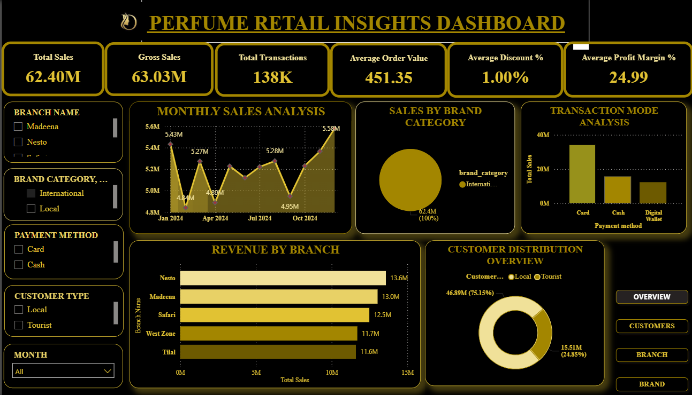
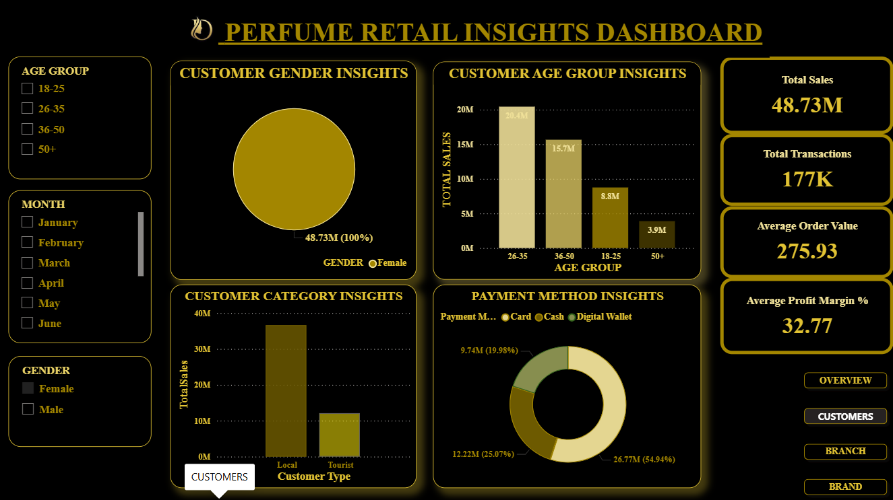
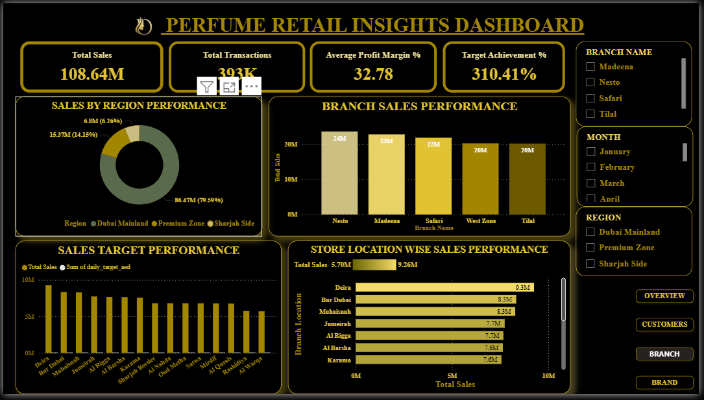
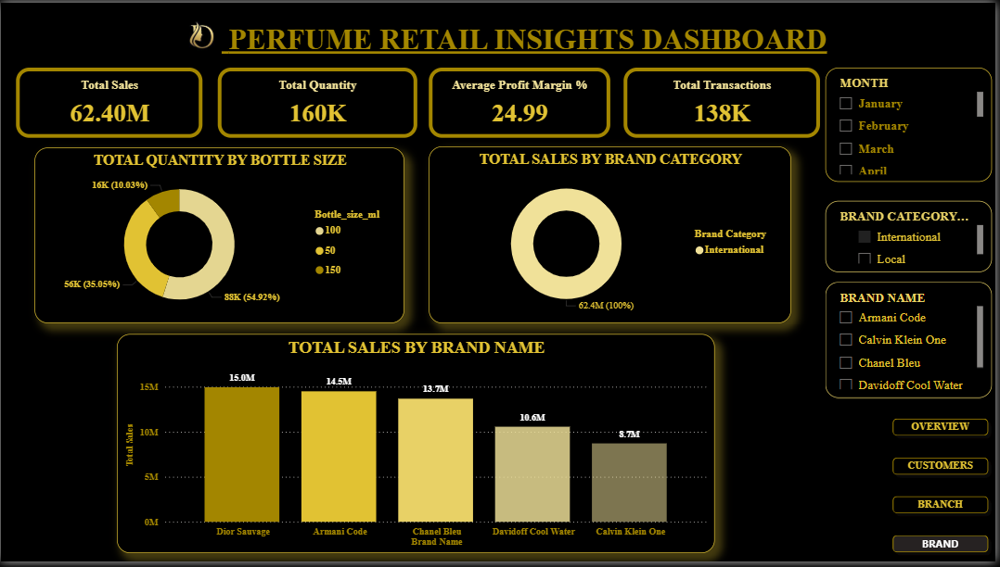

# 🌟 Perfume Retail Insights Dashboard | Power BI

## 📌 Project Overview

The Perfume Retail Insights Dashboard is an interactive Power BI project designed to analyze retail sales performance, customer behavior, branch operations, and brand performance.

The dashboard transforms raw sales data into actionable business insights through dynamic visualizations, KPI tracking, and interactive filtering capabilities.

---

## 🎯 Objectives

- Analyze overall sales performance
- Monitor key business KPIs
- Understand customer purchasing behavior
- Evaluate branch performance
- Identify top-performing brands and products
- Support data-driven business decisions

---

## 🛠️ Tools & Technologies

- Power BI Desktop
- Power Query
- DAX
- Data Modeling
- Data Visualization

---

## 📊 Key Performance Indicators

| KPI | Value |
|------|------|
| Total Sales | 62.40M |
| Gross Sales | 63.03M |
| Total Transactions | 138K |
| Average Order Value | 451.35 |
| Average Discount | 1.00% |
| Profit Margin | 24.99% |

---

## 📈 Dashboard Pages

### 1. Overview Dashboard

Provides a complete snapshot of business performance.

**Features:**
- Monthly Sales Trend
- Revenue by Branch
- Customer Distribution
- Payment Method Analysis
- Brand Category Performance

---

### 2. Customer Insights Dashboard

Analyzes customer demographics and buying behavior.

**Features:**
- Customer Age Groups
- Gender Distribution
- Customer Categories
- Payment Preferences

**Insight:**
- Customers aged 26–35 contribute the highest revenue.

---

### 3. Branch Performance Dashboard

Evaluates sales performance across branches and regions.

**Features:**
- Regional Sales Analysis
- Branch Revenue Comparison
- Target Achievement Tracking
- Store Performance Evaluation

**Insight:**
- Nesto branch generates the highest sales contribution.

---

### 4. Brand Insights Dashboard

Analyzes product and brand performance.

**Features:**
- Sales by Brand
- Product Category Analysis
- Bottle Size Distribution
- Top-Selling Products

**Insight:**
- Dior Sauvage is the highest revenue-generating brand.

---

## 📷 Dashboard Screenshots

### Overview Dashboard



### Customer Insights Dashboard



### Branch Performance Dashboard



### Brand Insights Dashboard



---

## 💡 Key Insights

- Local customers account for the majority of sales.
- Customers aged 26–35 generate the highest revenue.
- Card payments are the most preferred transaction method.
- International brands contribute significantly to total sales.
- Branch performance varies across regions, highlighting growth opportunities.

---

## 📂 Repository Contents

```text
Perfume-Retail-Insights-Dashboard/
│
├── Perfume_Retail_Insights_Dashboard.pbix
├── Overview_Dashboard.png
├── Customer_Insights_Dashboard.png
├── Branch_Performance_Dashboard.png
├── Brand_Insights_Dashboard.png
└── README.md
```

---

## 🚀 Skills Demonstrated

- Data Cleaning
- Data Transformation
- Data Modeling
- DAX Calculations
- Dashboard Development
- Business Analysis
- KPI Reporting
- Data Visualization
- Interactive Reporting

---

## 📌 Conclusion

This Power BI dashboard demonstrates how business intelligence techniques can transform retail sales data into meaningful insights. The solution enables stakeholders to monitor performance, identify trends, and make informed decisions through interactive and visually engaging reports.
